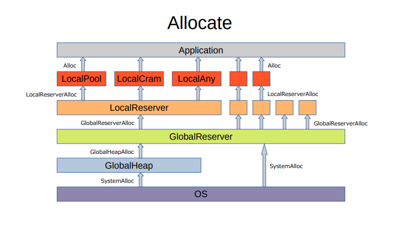

# 領式
領式（かなめしき）は、軽量で高速なメモリーアロケーターです。  

以下の特徴があります。  
* あらゆるサイズの、高速な割り当てと解放
* 高速な Cache 機構（自スレッド FreeList と、他スレッド FreeList）
  * 自スレッド FreeList 動作時、atomic 操作なし、CAS 操作なし（Lock-Free & Wait-Free）
  * 他スレッド FreeList 動作時、RevolverAtomic（Lock-Free、!Wait-Free）
  * 優先的な自スレッド FreeList の使用
* 高速な Reserver 機構（ローカル FreeList と、グローバル FreeList）
  * ローカル FreeList 動作時、atomic 操作なし、CAS 操作なし（Lock-Free & Wait-Free）
  * グローバル FreeList 動作時、RevolverSpinlock（Lock-Free、!Wait-Free）
  * 優先的なローカル FreeList の使用
* グローバル Heap 動作時、通常の Mutex（!Lock-Free、!Wait-Free）
* メモリー不足時の再試行
* 高効率なメモリーの活用
* 高効率な HardwareCache の活用
* スレッドスケーラブル
* 軽量なソースコード（総量50KB、行数2700）

 

# ベンチマーク
検証を行った環境は以下のとおりです。  
* Windows 10 Pro 64bit
* Core i7-8700 3.20GHz
* Memory 32GiB

testA ～ testI まで、9種類のテストを行った累計です。  
単位は秒で、数値が低いほど高速です。  
* testA ～ testE ：シンプルな並列動作テスト
* testF ～ testI ：より実践的なマルチスレッドプログラミングを想定したテスト
* 各テストの詳細は、Benchmark 下を参照してください

## 割り当てと解放のみ

**！注意！**：mimalloc は、「2MiB～32MiB」のテストで、割り当ての失敗が24万回起きている為、解放の負荷が計上されていません。  

## メモリーフィルを伴った、割り当てと解放（HardwareCache 効率）

**！注意！**：mimalloc は、「2MiB～32MiB」のテストで、割り当ての失敗が23万回起きている為、メモリーフィルと解放の負荷が計上されていません。  

 

# 構造

 

# 解説
## 高速化の要因
以下の問題を起こさない、又は克服する、或いは軽減することにより、高速化を実現します。  
* atomic fighting 問題
  * １つの atomic 変数にアクセスが集中すると、処理速度が低下します
* lock conflict 問題
  * １つの atomic 変数に CAS 操作が集中すると、処理速度が著しく低下します
* スレッド実行権の譲渡問題
  * OS のスレッド再スケジュールにより、処理速度が低下します

## Cache 機構
### 自スレッド FreeList と、他スレッド FreeList
* 割り当て可能な領域を保持します
* 自スレッド FreeList は、自スレッドの単独アクセスが保証されています（atomic 操作なし、CAS 操作なし）
* 他スレッド FreeList は、複数のスレッドから同時にアクセスされます
* 自スレッドと他スレッドで、FreeList を分散アクセスします（並列動作効率の向上）
* スレッド実行権を譲渡しません

### 割り当て
* 割り当て要求が来ると、自スレッド FreeList から領域を取り出し、アプリケーションに返します
* 自スレッド FreeList が空であれば、他スレッド FreeList から割り当てを行います（RevolverAtomic）
* 他スレッド FreeList が空であれば、Cache 機構を所持しているアロケーターに処理を委ねます

### 解放
* 自スレッドで行った解放は、自スレッド FreeList に領域を保持します
* 他スレッドで行った解放は、他スレッド FreeList に領域を保持します（RevolverAtomic）

## RevolverAtomic 機構
### 割り当て Revolver と、解放 Revolver
* 割り当て Revolver は、要求毎に専用の Atomic インデックスを回転します
* 解放 Revolver は、要求毎に専用の Atomic インデックスを回転します
* 割り当てと解放で、Atomic インデックスを分散アクセスします
* 割り当ての要求や、解放の同時要求では、Atomic 操作を分散アクセスします（lock conflict 問題を軽減）
* スレッド実行権を譲渡しません

## Reserver 機構
### ローカル FreeList と、グローバル FreeList
* 割り当て可能な領域を保持します
* ローカル FreeList は、自スレッドの単独アクセスが保証されています（atomic 操作なし、CAS 操作なし）
* グローバル FreeList は、複数のスレッドから同時にアクセスされます
* ローカルとグローバルで、FreeList を分散アクセスします（並列動作効率の向上）
* スレッド実行権を譲渡しません

### 割り当て
* 割り当て要求が来ると、ローカル FreeList から領域を取り出し、アプリケーションに返します
* ローカル FreeList が空であれば、グローバル FreeList から割り当てを行います（RevolverSpinlock）
* グローバル FreeList が空であれば、GlobalHeap から割り当てを行います（通常の Mutex）
* GlobalHeap からの割り当てに失敗した場合、OS から割り当てを行います（排他制御は OS に委ねる）
* OS からの割り当てに失敗した場合、ローカル FreeList と グローバル FreeList に保持していた領域を解放し、割り当てを再試行します

### 解放
* 自スレッドで行った解放は、ローカル FreeList に領域を保持します
* 他スレッドで行った解放は、グローバル FreeList に領域を保持します（RevolverSpinlock）

## RevolverSpinlock 機構
### 割り当て Revolver と、解放 Revolver
* 割り当て Revolver は、要求毎に専用の Spinlock インデックスを回転します
* 解放 Revolver は、要求毎に専用の Spinlock インデックスを回転します
* 割り当てと解放で、Spinlock インデックスを分散アクセスします（atomic fighting 問題を軽減）
* 割り当ての同時要求や、解放の同時要求では、Spinlock を分散アクセスします（lock conflict 問題を軽減）
* スレッド実行権を譲渡しません

## LocalPool
### 固定サイズのプール型アロケーター
* Cache 機構を持ちます
* std::size_t の倍数サイズを割り当てます
* 初期状態では、予め全ての領域を自スレッド FreeList に保持します
* FreeList が空の場合、新たな LocalPool を生成し、割り当てを行います
* 領域が満たされた場合や、スレッドが破棄された場合、清算状態に移行します
* 清算状態で、全ての領域が解放されると、自身を破棄します

## LocalCram
### 柔軟サイズの詰込み型アロケーター
* Cache 機構を持ちます
* 「2のN乗 ≦ サイズ ＜ 2のN+1乗」を割り当てます
* 初期状態では、自スレッド FreeList と、他スレッド FreeList は空です
* FreeList が空の場合、要求サイズの空きがあれば、領域を割り当て、アプリケーションに返します
* 要求サイズの空きがなければ、新たな LocalCram を生成し、割り当てを行います
* 領域に空きがない場合や、スレッドが破棄された場合、清算状態に移行します
* 清算状態で、全ての領域が解放されると、自身を破棄します

## LocalAny
### 任意サイズのアロケーター
* 常に新たな LocalAny を生成し、割り当てを行います
* 領域が解放されると、自身を破棄します

## LocalReserver
自スレッドで行われる、LocalPool、LocalCram、LocalAny の割り当て（生成）と解放（破棄）を処理します。  
* ローカル FreeList を持ちます

## GlobalReserver
LocalReserver からの割り当て要求と解放要求、他スレッドで行われる、LocalPool、LocalCram、LocalAny の解放（破棄）を処理します。  
* グローバル FreeList を持ちます

## GlobalHeap
### 任意サイズのアロケーター
GlobalReserver からの割り当て要求と開放要求を処理します。  
* 双方向リストによるノードベースでの割り当てを行います
* 解放時、隣接するノードが解放済みであれば、マージを行います

 

# 協調型と特化型の特徴
## 協調型
汎用 OS 向けのアプリケーションに適したタイプです。  
* 小さな GlobalHeap サイズを確保します
* 動作している他のアプリケーションに配慮し、メモリーを融通します
* SystemAlloc と SystemFree の回数が増え、低速になる傾向です

## 特化型
組み込み向け（ゲームコンソールなど）のアプリケーションに適したタイプです。  
* 大きな GlobalHeap サイズを確保します
* 動作している他のアプリケーションに配慮せず、メモリーを占有します
* SystemAlloc と SystemFree の回数が減り、高速になる傾向です

 

# ビルド
## Windows
### **Msvc**
~~~
./build_m.bat
~~~

## Linux
### **g++**
~~~
bash ./build_g.sh
~~~

### **clang++**
~~~
bash ./build_c.sh
~~~

 

# テスト
共通の、追加のコンパイルオプション  
~~~
-DCATEGORY=0～4
0 or undefined : 0B～32MiB
1 : 0B～1KiB
2 : 2KiB～32KiB
3 : 32KiB～1MiB
4 : 2MiB～32MiB

-DFILL=0～1
0 or undefined : NOP
1 : Memory Fill & Strick Check
~~~

## Windows
### **Msvc**
**領式（特化型）**  
~~~
cl -DNDEBUG -DKANAMESHIKI Main.cpp CLog.cpp -Ox -EHsc -Fe:KanameShiki1.exe KanameShiki1.lib
./KanameShiki1.exe
~~~
**領式（協調型）**  
~~~
cl -DNDEBUG -DKANAMESHIKI Main.cpp CLog.cpp -Ox -EHsc -Fe:KanameShiki0.exe KanameShiki0.lib
./KanameShiki0.exe
~~~
**malloc**  
~~~
cl -DNDEBUG Main.cpp CLog.cpp -Ox -EHsc -Fe:Malloc.exe
./Malloc.exe
~~~

#### **ご自身で環境を整えられる方向け**
**mimalloc**（ビルドした環境に依存する為、別環境でビルドした mimalloc.lib をリンクしようとした場合、リンクエラーが発生する場合があります）  
~~~
cl -DNDEBUG -DMIMALLOC Main.cpp CLog.cpp -Ox -EHsc -Fe:MiMalloc.exe mimalloc.lib advapi32.lib -MD -link -LTCG
./MiMalloc.exe
~~~
**tcmalloc**  
~~~
cl -DNDEBUG -DTCMALLOC Main.cpp CLog.cpp -Ox -EHsc -Fe:TcMalloc.exe libtcmalloc_minimal.lib
./TcMalloc.exe
~~~
**jemalloc**（Segmentation fault が多発しますが、何度か繰り返すと動きます。正常動作しているかは不明です）  
~~~
cl -DNDEBUG -DJEMALLOC Main.cpp CLog.cpp -Ox -EHsc -Fe:JeMalloc.exe jemalloc.lib -I"jemalloc/include/msvc_compat"
./JeMalloc.exe
~~~

## Linux
### **g++**
**準備**
~~~
g++ -DNDEBUG Main.cpp CLog.cpp -O3 -lpthread -latomic -o Malloc_g.exe
~~~
**領式（特化型）**  
~~~
LD_PRELOAD=./KanameShiki1_g.so ./Malloc_g.exe
~~~
**領式（協調型）**  
~~~
LD_PRELOAD=./KanameShiki0_g.so ./Malloc_g.exe
~~~
**malloc**  
~~~
./Malloc_g.exe
~~~

### **clang++**
**準備**
~~~
clang++ -DNDEBUG Main.cpp CLog.cpp -std=c++14 -O3 -lpthread -latomic -o Malloc_c.exe
~~~
**領式（特化型）**  
~~~
LD_PRELOAD=./KanameShiki1_c.so ./Malloc_c.exe
~~~
**領式（協調型）**  
~~~
LD_PRELOAD=./KanameShiki0_c.so ./Malloc_c.exe
~~~
**malloc**  
~~~
./Malloc_c.exe
~~~

 

# 余談
如何だったでしょうか？  

残念なことに、Mingw64 の g++ と clang++ では、動作しない事を確認しています。  
Mingw64 の g++ は、スレッドの破棄タイミングが異常な為、正常に終了できません。  
Mingw64 の clang++ は、thread_local が POD 型しか対応しておらず、コンパイルが通りません。  

---
もし、高速な比較安定ソートアルゴリズムに興味あれば、[颯式（はやてしき）](https://github.com/EmuraDaisuke/SortingAlgorithm.HayateShiki) もご覧ください。