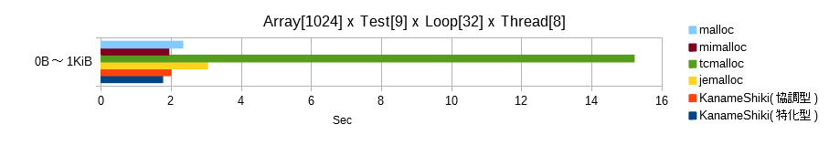
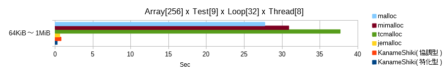
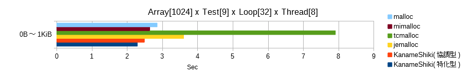
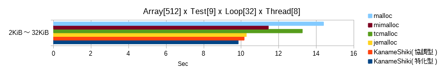
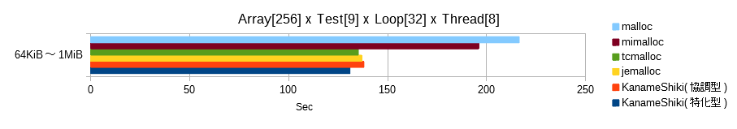
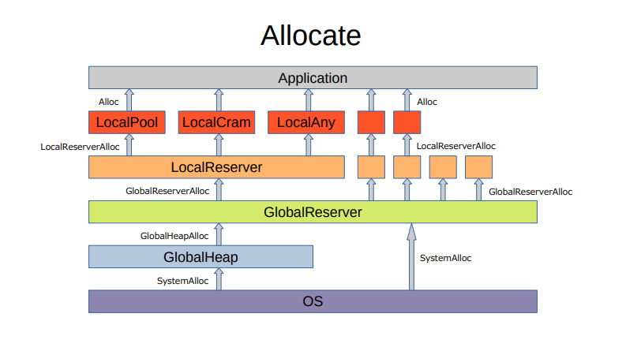
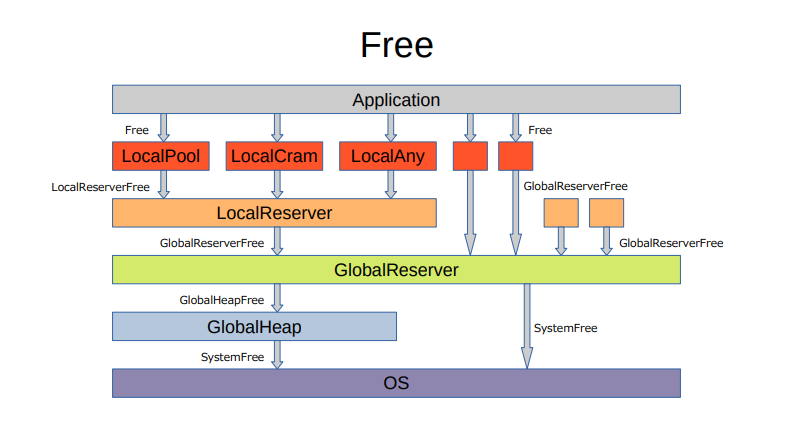

# 領式(Kaname-Shiki)
Kaname-Shiki is a lightweight and fast memory allocator.  

It has the following features.  
* Fast allocation and free of any size
* Fast Cache mechanism (own thread FreeList and other thread FreeList)
  * At the time of own thread FreeList operation, no atomic operation, no CAS operation (Lock-Free & Wait-Free)
  * Use RevolverAtomic when working with other thread FreeList (Lock-Free, !Wait-Free)
  * Use own-threaded FreeList preferentially
* Fast Reserver mechanism (local FreeList and global FreeList)
  * When operating with local FreeList, no atomic operation, no CAS operation (Lock-Free & Wait-Free)
  * Use RevolverSpinlock when working with Global FreeList (Lock-Free, !Wait-Free)
  * Use a preferred local FreeList
* When working with Global Heap, normal Mutex (!Lock-Free, !Wait-Free)
* Retry when memory is low
* Utilization of highly efficient memory
* Utilization of highly efficient HardwareCache
* Thread scalable
* Light source code (total 50KB, 2700 lines)

 

# Benchmark
The verified environment is as follows.  
* Windows 10 Pro 64bit
* Core i7-8700 3.20GHz
* Memory 32GiB

This is the cumulative total of nine tests from testA to testI.  
The unit is seconds. The lower the number, the faster.  
* testA to testE: Simple parallel operation test
* testF to testI: Tests assuming more practical multi-thread programming
* See the Benchmark directory for details on each test

## Allocation and Free only

** ! Note ! ** : Mimalloc does not account for the Free load because the allocation failure occurred 240,000 times in the “2MiB to 32MiB” test.  

## Allocation and Free with memory filling (HardwareCache efficiency)

** ! Note ! ** : Mimalloc does not account for the memory fill and Free load due to 230,000 allocation failures in the "2MiB to 32MiB" test.  

 

# Construction

 

# Explanation

## Factors for speeding up
Speed ​​up is achieved by avoiding, overcoming, or mitigating the following problems.  
* atomic fighting problem
  * When access concentrates on one atomic variable, processing speed decreases.
* lock conflict problem
  * When CAS operations are concentrated on one atomic variable, the processing speed is significantly reduced.
* Thread execution right transfer problem
  * Thread rescheduling by the OS slows down processing speed

## Cache mechanism
### Own thread FreeList and other threads FreeList
* Keep allocatable space
* The own thread FreeList is guaranteed to be accessed by its own thread (no atomic operation, no CAS operation)
* Other thread FreeList is accessed simultaneously from multiple threads
* FreeList is distributedly accessed by its own thread and other threads (improved parallel operation efficiency)
* Do not transfer thread execution right

### Allocation
* When an allocation request comes, the area is taken out from its own thread FreeList and returned to the application
* If the own thread FreeList is empty, allocation is performed from the other thread FreeList (RevolverAtomic)
* If other thread FreeList is empty, entrust processing to the allocator that has the Cache mechanism

### Free
* Free performed in its own thread holds the area in its own thread FreeList
* Free performed in another thread holds the area in its other thread FreeList (RevolverAtomic)

## RevolverAtomic mechanism
### Allocation Revolver and Free Revolver
* Allocation Revolver rotates a dedicated Atomic index on every request
* Free Revolver rotates a dedicated Atomic index on every request
* Distribute access between allocated and freed Atomic indexes
* Distributed access to atomic operations for allocation requests and simultaneous free requests (reduce the lock conflict problem)
* Do not transfer thread execution right

## Reserver mechanism
### Local FreeList and Global FreeList
* Keep allocatable space
* Local FreeList is guaranteed to be accessed by its own thread (no atomic operation, no CAS operation)
* Global FreeList is accessed from multiple threads simultaneously
* FreeList is distributedly accessed by its own thread and other threads (improved parallel operation efficiency)
* Do not transfer thread execution right

### Allocation
* When an allocation request comes, it takes the area from the local FreeList and returns it to the application
* If the local FreeList is empty, allocate from the global FreeList (RevolverSpinlock)
* If global FreeList is empty, assign from GlobalHeap (normal mutex)
* If allocation from GlobalHeap fails, allocation is performed from the OS (exclusive control is left to the OS)
* If allocation from the OS fails, free the space held in the local FreeList and global FreeList and retry the allocation

### Free
* Free performed by the own thread retains space in the local FreeList
* Free performed in another thread holds the area in its global FreeList

## RevolverSpinlock mechanism
### Allocation Revolver and Free Revolver
* Allocation Revolver rotates a dedicated Spinlock index on every request
* Free Revolver rotates a dedicated Spinlock index on every request
* Distribute access between allocated and freed Spinlock indexes (reduces atomic fighting problems)
* Spinlock is distributedly accessed for simultaneous allocation requests and simultaneous free requests (reducing lock conflict problems)
* Do not transfer thread execution right

## LocalPool
### Fixed size pool allocator
* Has a Cache mechanism
* Allocates a multiple of std::size_t
* In the initial state, all areas are stored in the own thread FreeList in advance.
* If FreeList is empty, create a new LocalPool and assign it
* When the area is full or the thread is destroyed, it moves to the Clearance state
* In the Clearance state, when all areas are freed, destroy itself

## LocalCram
### Flexible sized allocator
* Has a Cache mechanism
* Allocates a "2 to the power of N ≤ size <2 to the power of (N+1)"
* In the initial state, the own thread FreeList and the other thread FreeList are empty
* If FreeList is empty, allocate space and return to application if requested size is available
* If there is no free space for the requested size, a new LocalCram is created and allocated
* If there is no space in the area or if the thread is destroyed, it moves to the Clearance state
* In the Clearance state, when all areas are freed, destroy itself

## LocalAny
### Any size allocator
* Always create and assign a new LocalAny
* Destroys itself when space is freed

## LocalReserver
Handles allocation (generation) and free(destroy) of LocalPool, LocalCram, and LocalAny that are performed in the local thread.
* Has a local FreeList

## GlobalReserver
Handles allocation and free requests from LocalReserver, and free(destroy) of LocalPool, LocalCram, and LocalAny made by other threads.
* Has a global FreeList

## GlobalHeap
### Any size allocator
Handles allocation and free requests from GlobalReserver.
* Node-based assignment using a bidirectional list
* When freeing, if adjacent nodes have been freed, merge

 

# Features of cooperative(協調型) and specialized types(特化型)
## Cooperative(協調型)
This type is suitable for general-purpose OS applications.  
* Secure small GlobalHeap size
* Flexible memory with other running applications
* SystemAlloc and SystemFree are increasing in number and tend to be slow

## Specialized type(特化型)
This type is suitable for embedded applications (such as game consoles).  
* Ensure large GlobalHeap size
* Occupies memory without considering other running applications
* The number of SystemAlloc and SystemFree decreases, and it tends to be faster

 

# Build
## Windows
### **Msvc**
~~~
./build_m.bat
~~~

## Linux
### **g++**
~~~
bash ./build_g.sh
~~~

### **clang++**
~~~
bash ./build_c.sh
~~~

 

# Test
Common additional compilation options  
~~~
-DCATEGORY=0～4
0 or undefined : 0B～32MiB
1 : 0B～1KiB
2 : 2KiB～32KiB
3 : 32KiB～1MiB
4 : 2MiB～32MiB

-DFILL=0～1
0 or undefined : NOP
1 : Memory Fill & Strick Check
~~~

## Windows
### **Msvc**
**Kaname-Shiki（特化型）**  
~~~
cl -DNDEBUG -DKANAMESHIKI Main.cpp CLog.cpp -Ox -EHsc -Fe:KanameShiki1.exe KanameShiki1.lib
./KanameShiki1.exe
~~~
**Kaname-Shiki（協調型）**  
~~~
cl -DNDEBUG -DKANAMESHIKI Main.cpp CLog.cpp -Ox -EHsc -Fe:KanameShiki0.exe KanameShiki0.lib
./KanameShiki0.exe
~~~
**malloc**  
~~~
cl -DNDEBUG Main.cpp CLog.cpp -Ox -EHsc -Fe:Malloc.exe
./Malloc.exe
~~~

### **For those who can create their own environment**
**mimalloc**（Because it depends on the built environment, if you try to link mimalloc.lib built in another environment, a link error may occur）  
~~~
cl -DNDEBUG -DMIMALLOC Main.cpp CLog.cpp -Ox -EHsc -Fe:MiMalloc.exe mimalloc.lib advapi32.lib -MD -link -LTCG
./MiMalloc.exe
~~~
**tcmalloc**  
~~~
cl -DNDEBUG -DTCMALLOC Main.cpp CLog.cpp -Ox -EHsc -Fe:TcMalloc.exe libtcmalloc_minimal.lib
./TcMalloc.exe
~~~
**jemalloc**（Segmentation fault occurs frequently, but it works when repeated several times. It is unknown whether it is operating normally）  
~~~
cl -DNDEBUG -DJEMALLOC Main.cpp CLog.cpp -Ox -EHsc -Fe:JeMalloc.exe jemalloc.lib -I"jemalloc/include/msvc_compat"
./JeMalloc.exe
~~~

## Linux
### **g++**
**Preparation**
~~~
g++ -DNDEBUG Main.cpp CLog.cpp -O3 -lpthread -latomic -o Malloc_g.exe
~~~
**Kaname-Shiki（特化型）**  
~~~
LD_PRELOAD=./KanameShiki1_g.so ./Malloc_g.exe
~~~
**Kaname-Shiki（協調型）**  
~~~
LD_PRELOAD=./KanameShiki0_g.so ./Malloc_g.exe
~~~
**malloc**  
~~~
./Malloc_g.exe
~~~

### **clang++**
**Preparation**
~~~
clang++ -DNDEBUG Main.cpp CLog.cpp -std=c++14 -O3 -lpthread -latomic -o Malloc_c.exe
~~~
**Kaname-Shiki（特化型）**  
~~~
LD_PRELOAD=./KanameShiki1_c.so ./Malloc_c.exe
~~~
**Kaname-Shiki（協調型）**  
~~~
LD_PRELOAD=./KanameShiki0_c.so ./Malloc_c.exe
~~~
**malloc**  
~~~
./Malloc_c.exe
~~~

 

# Finally
How was it?  

Unfortunately, Mingw64 g++ and clang++ have been confirmed not to work.  
Mingw64 g++ cannot be terminated normally due to abnormal thread destruction timing.  
Mingw64 clang++ doesn't compile because thread_local only supports POD type.  

---
If you are interested in a fast comparative stable sorting algorithm, see [颯式（Hayate-Shiki）] (https://github.com/EmuraDaisuke/SortingAlgorithm.HayateShiki).